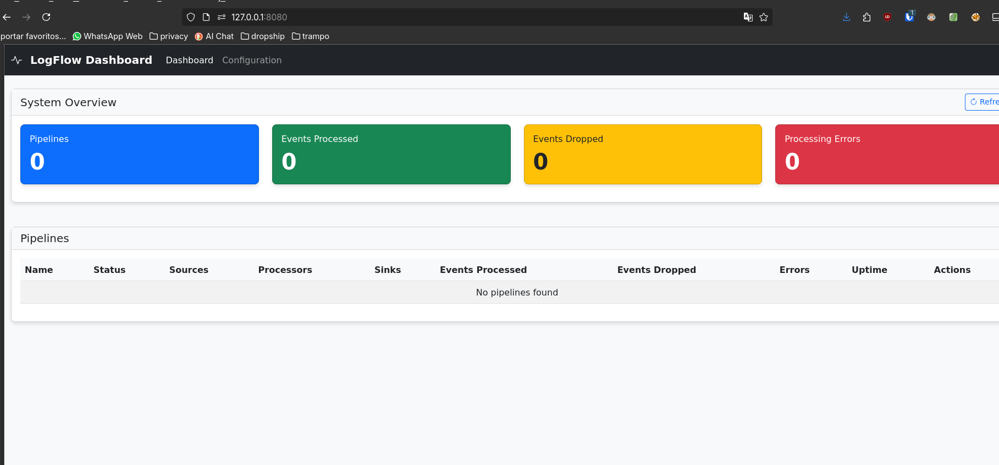

# LogFlow: Sistema de ETL para Processamento de Logs

LogFlow é uma aplicação ETL (Extração, Transformação e Carregamento) especializada em processamento de logs, inspirada em ferramentas como Graylog e Logstash. A aplicação é capaz de receber logs de múltiplas fontes, processá-los através de transformações configuráveis e encaminhá-los para diferentes destinos de armazenamento ou análise.



## Características Principais

- Arquitetura modular baseada em plugins
- Suporte para múltiplas fontes de dados (arquivos, Kafka, S3, etc.)
- Processadores configuráveis para transformação e filtragem
- Múltiplos destinos para os logs processados (Elasticsearch, OpenSearch, S3, arquivos, etc.)
- API REST para gerenciamento
- Interface de linha de comando
- Alta performance e confiabilidade

## Componentes Disponíveis

### Sources (Fontes)
- **file**: Lê logs de arquivos locais com suporte a monitoramento contínuo (tail)
- **kafka**: Consome logs de tópicos do Apache Kafka
- **s3**: Lê logs de buckets do Amazon S3
- **winlog**: Lê logs de eventos do Windows (Winlogbeat)

### Processors (Processadores)
- **json**: Analisa dados JSON e extrai campos
- **filter**: Filtra eventos com base em condições configuráveis
- **regex**: Extrai campos usando expressões regulares
- **grok**: Extrai campos usando padrões Grok (similar ao Logstash)
- **mutate**: Modifica campos (adicionar, remover, renomear, converter, etc.)
- **enrich**: Enriquece eventos com dados adicionais (lookup, geolocalização, etc.)

### Sinks (Destinos)
- **file**: Escreve logs em arquivos locais
- **elasticsearch**: Envia logs para o Elasticsearch
- **opensearch**: Envia logs para o OpenSearch
- **s3**: Armazena logs em buckets do Amazon S3

### Interface Web
O LogFlow inclui uma interface web para monitoramento e gerenciamento de pipelines:

```bash
# Iniciar a interface web
logflow web --port 8080
```

A interface web permite:
- Visualizar o status de todas as pipelines
- Iniciar e parar pipelines
- Monitorar métricas de processamento em tempo real
- Carregar novas configurações

## Instalação

### Requisitos

- Python 3.9 ou superior
- Poetry

### Instalação com Poetry

```bash
# Clonar o repositório
git clone https://github.com/organization/logflow.git
cd logflow

# Instalar dependências
poetry install

# Instalar em modo de desenvolvimento
poetry install --with dev
```

## Uso Básico

### Executando com a CLI

```bash
# Usando poetry
poetry run logflow start --config examples/simple.yaml

# Ou após ativar o ambiente virtual
logflow start --config examples/simple.yaml
```

### Verificando o Status

```bash
poetry run logflow status
```

### Reiniciando uma Pipeline

```bash
poetry run logflow restart --pipeline simple-pipeline
```

## Configuração

LogFlow utiliza arquivos YAML para configuração. Um exemplo básico:

```yaml
name: "simple-pipeline"

sources:
  - name: "test-file"
    type: "FileSource"
    config:
      path: "/tmp/test.log"
      tail: true
      read_from_start: true

processors:
  - name: "json-parser"
    type: "JsonProcessor"
    config:
      field: "raw_data"
      target_field: "parsed"
      preserve_original: true
      ignore_errors: true

  - name: "filter-debug"
    type: "FilterProcessor"
    config:
      condition: "level != 'DEBUG'"
      mode: "all"

sinks:
  - name: "file-output"
    type: "FileSink"
    config:
      path: "/tmp/processed.log"
      format: "json"
      append: true

batch_size: 100
batch_timeout: 5.0
```

## API REST

A API REST permite gerenciar o LogFlow programaticamente:

```
GET    /api/v1/pipelines         # Listar todas as pipelines
POST   /api/v1/pipelines         # Criar uma nova pipeline
GET    /api/v1/pipelines/{id}    # Obter detalhes de uma pipeline
DELETE /api/v1/pipelines/{id}    # Remover uma pipeline
POST   /api/v1/pipelines/{id}/start  # Iniciar uma pipeline
POST   /api/v1/pipelines/{id}/stop   # Parar uma pipeline
GET    /api/v1/metrics           # Obter métricas do sistema
```

## Desenvolvimento

### Executando Testes

```bash
poetry run pytest
```

## 📖 Documentação

```bash
poetry run sphinx-build -b html docs/source docs/build
```

## Arquitetura

A arquitetura do LogFlow é baseada em uma estrutura modular de plugins, dividida em três componentes principais:

1. **Sources (Fontes)**: Plugins responsáveis pela obtenção dos logs de diferentes origens.
2. **Processors (Processadores)**: Componentes que processam, filtram e transformam os dados de log.
3. **Sinks (Destinos)**: Plugins responsáveis pelo envio dos logs processados para os destinos finais.

## 🤝 Contribuindo

1. Faça um fork do repositório
2. Crie um branch para sua feature (`git checkout -b feature/nova-feature`)
3. Faça commit das suas mudanças (`git commit -am 'Adiciona nova feature'`)
4. Faça push para o branch (`git push origin feature/nova-feature`)
5. Crie um novo Pull Request

## 📜 Licença

Este projeto está licenciado sob a licença MIT - veja o arquivo LICENSE para detalhes.


## 📈 Progress

Veja o progresso do logflow

[](https://www.star-history.com/#souzomain/logflow&Date)
